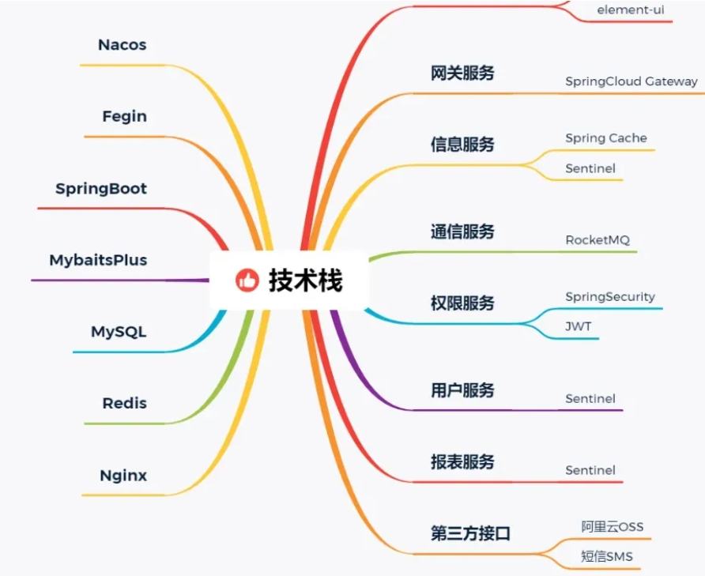
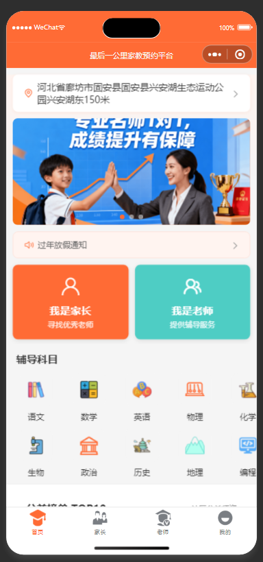
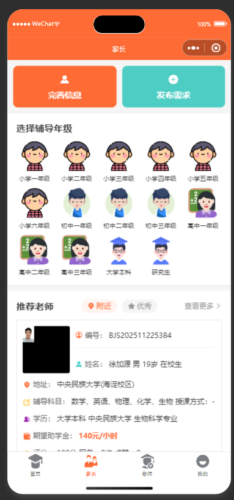
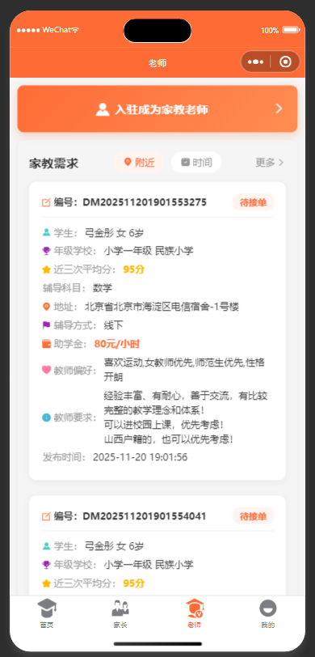
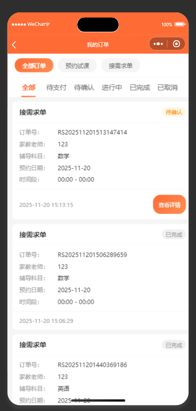
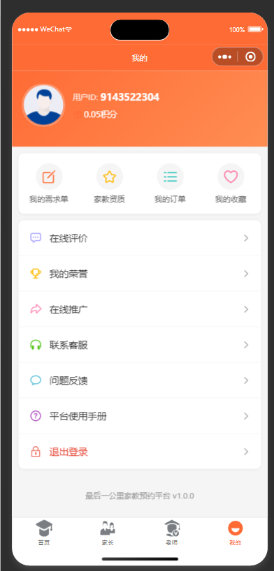

# 最后一公里家教预约平台

<div align="center">

[](LICENSE)
[](https://spring.io/projects/spring-boot)
[](https://vuejs.org/)
[](https://uniapp.dcloud.io/)

一个专业的家教预约平台，连接优秀教师与家长，提供便捷的家教服务

如果这个项目对您有帮助，右上角请给我们一个 Star ⭐非常感谢

</div>

---

## 📖 项目介绍

最后一公里家教预约平台是一个完整的家教服务解决方案，包含微信小程序端、Web管理后台和后端服务系统。平台支持家长发布教学需求、教师接单、试课预约、在线评价、作业管理、推广返利等完整业务流程，为家教服务提供全方位的数字化支持。

### ✨ 核心特性

- 🎯 **双端角色系统** - 支持家长端和教师端，满足不同用户需求
- 💰 **完整的押金体系** - 家长入驻、教师入驻、需求发布、接单等多场景押金管理
- 📝 **智能需求匹配** - 家长发布需求，系统智能推荐合适的教师
- 🎓 **试课预约机制** - 支持预约试课，满意后再正式开课
- ⭐ **多维度评价** - 试课评价、服务评价，保障教学质量
- 📚 **作业管理系统** - 教师可在线布置作业，家长实时查看
- 🎁 **推广返利功能** - 支持推广返利，激励用户传播
- 💳 **微信支付集成** - 深度集成微信支付，交易安全便捷
- 📊 **数据可视化** - 完善的数据统计和图表展示
- 🔒 **权限管理系统** - 基于RBAC的完整权限控制

---

## 🛠️ 技术栈

系统分为移动端和后台，移动端是通过uniapp实现的，后台是通过springboot+vue实现的。



### 后端技术

<p align="center">

| 技术 | 版本 | 说明 |
|------|------|------|
| Java | 1.8 | 编程语言 |
| Spring Boot | 2.5.15 | 应用框架 |
| Spring Security | 5.7.14 | 认证授权 |
| MyBatis | - | ORM框架 |
| MySQL | 8.0.24 | 数据库 |
| Redis | - | 缓存 |
| Druid | 1.2.23 | 连接池 |
| Quartz | - | 定时任务 |
| JWT | 0.9.1 | Token认证 |
| FastJSON | 2.0.58 | JSON处理 |
| Swagger | 3.0.0 | API文档 |
| 阿里云OSS | - | 对象存储 |
| 微信支付 | APIv2 | 支付接口 |

</p>

### 前端技术

#### 管理后台 (tutor-ui)

| 技术 | 版本 | 说明 |
|------|------|------|
| Vue | 3.5.16 | 前端框架 |
| Vite | 6.3.5 | 构建工具 |
| Element Plus | 2.10.7 | UI组件库 |
| Pinia | 3.0.2 | 状态管理 |
| Vue Router | 4.5.1 | 路由管理 |
| Axios | 1.9.0 | HTTP客户端 |
| ECharts | 5.6.0 | 数据可视化 |

#### 小程序端 (tutor-uniapp)

- **uni-app** - 跨平台开发框架
- **Vue 3** - 前端框架
- **uni-ui** - UI组件库（50+组件）
- **微信小程序** - 目标平台

---

## 📁 项目结构

```
Tutor/
├── tutor-admin/              # Spring Boot 应用入口
│   ├── src/main/java/        # Java 源码
│   │   └── com/tutor/web/
│   │       ├── controller/   # 控制器层
│   │       │   ├── miniapp/  # 小程序API
│   │       │   ├── system/   # 系统管理API
│   │       │   └── monitor/  # 监控API
│   │       └── core/         # 核心配置
│   └── src/main/resources/
│       ├── application.yml   # 主配置
│       ├── mapper/           # MyBatis映射
│       └── cert/             # 微信支付证书
│
├── tutor-framework/          # 框架核心模块
│   └── src/main/java/com/tutor/framework/
│       ├── config/           # 系统配置
│       ├── security/         # 安全认证
│       ├── aspectj/          # AOP切面
│       └── interceptor/      # 拦截器
│
├── tutor-system/             # 系统业务模块
│   └── src/main/java/com/tutor/system/
│       ├── controller/       # 系统控制器
│       ├── domain/           # 实体类、VO
│       ├── mapper/           # 数据映射
│       └── service/          # 业务服务
│
├── tutor-common/             # 通用工具模块
├── tutor-quartz/             # 定时任务模块
├── tutor-generator/          # 代码生成模块
│
├── tutor-ui/                 # Vue3 管理后台
│   ├── src/
│   │   ├── api/              # API接口
│   │   ├── assets/           # 静态资源
│   │   ├── components/       # 公共组件（27个）
│   │   ├── layout/           # 布局组件
│   │   ├── router/           # 路由配置
│   │   ├── store/            # Pinia状态管理
│   │   ├── utils/            # 工具函数
│   │   └── views/            # 页面视图
│   └── vite.config.js        # Vite配置
│
├── tutor-uniapp/             # uni-app 小程序
│   ├── pages/                # 页面（14个模块）
│   │   ├── index/            # 首页
│   │   ├── parent/           # 家长端
│   │   ├── teacher/          # 教师端
│   │   ├── my/               # 个人中心
│   │   ├── payment/          # 支付模块
│   │   ├── order/            # 订单管理
│   │   ├── evaluation/       # 评价模块
│   │   ├── homework/         # 作业管理
│   │   └── ...
│   ├── api/                  # API接口（17个模块）
│   ├── components/           # 公共组件
│   ├── utils/                # 工具函数
│   ├── uni_modules/          # uni-ui组件库
│   ├── pages.json            # 页面配置
│   └── manifest.json         # 小程序配置
│
├── sql/
│   └── tutor.sql             # 数据库脚本（54张表）
│
├── bin/                      # 构建脚本
│   ├── run.bat               # 运行脚本
│   ├── package.bat           # 打包脚本
│   └── clean.bat             # 清理脚本
│
├── pom.xml                   # Maven父配置
└── README.md                 # 项目说明
```

---

## 🚀 快速开始

### 环境要求

- **JDK**: 1.8+
- **Maven**: 3.6+
- **MySQL**: 8.0+
- **Redis**: 5.0+
- **Node.js**: 16+
- **HBuilderX**: 最新版（用于小程序开发）

### 后端部署

#### 1. 创建数据库

```bash
# 登录MySQL，创建数据库
mysql -u root -p
CREATE DATABASE tutor DEFAULT CHARACTER SET utf8mb4 COLLATE utf8mb4_unicode_ci;

# 导入SQL脚本
use tutor;
source sql/tutor.sql;
```

#### 2. 修改配置

编辑 `tutor-admin/src/main/resources/application.yml`：

```yaml
# 数据库配置
spring:
  datasource:
    url: jdbc:mysql://localhost:3306/tutor?useUnicode=true&characterEncoding=utf8&zeroDateTimeBehavior=convertToNull&useSSL=true&serverTimezone=GMT%2B8
    username: root
    password: your_password

# Redis配置
  redis:
    host: localhost
    port: 6379
    password: your_redis_password

# 微信小程序配置
wx:
  miniapp:
    appId: your_appid
    appSecret: your_appsecret

# 微信支付配置
wxpay:
  mchId: your_mch_id
  apiKey: your_api_key

# 阿里云OSS配置（可选）
aliyun:
  oss:
    accessKeyId: your_access_key_id
    accessKeySecret: your_access_key_secret
    bucketName: your_bucket_name
```

#### 3. 编译运行

```bash
# 使用Maven打包
cd Tutor
mvn clean package

# 运行（Windows）
bin/run.bat

# 运行（Linux/Mac）
java -jar tutor-admin/target/tutor-admin.jar

# 访问后台管理系统
# http://localhost:8080
# 默认账号: admin
# 默认密码: admin123
```

### 前端部署

#### 1. 安装依赖

```bash
cd tutor-ui
npm install
```

#### 2. 修改配置

编辑 `.env.development`：

```env
# 开发环境配置
VITE_APP_BASE_API = '/dev-api'
```

编辑 `vite.config.js` 中的代理地址：

```javascript
proxy: {
  '/dev-api': {
    target: 'http://localhost:8080',  // 后端地址
    changeOrigin: true,
    rewrite: (path) => path.replace(/^\/dev-api/, '')
  }
}
```

#### 3. 启动开发服务器

```bash
# 开发模式
npm run dev

# 访问地址：http://localhost:80
```

#### 4. 生产构建

```bash
npm run build:prod
```

### 小程序部署

#### 1. 导入项目

使用 **HBuilderX** 打开 `tutor-uniapp` 目录

#### 2. 修改配置

编辑 `manifest.json`：

```json
{
  "mp-weixin": {
    "appid": "your_appid"
  }
}
```

编辑小程序API地址（如 `utils/request.js`）：

```javascript
const baseURL = 'https://your-domain.com'; // 生产环境API地址
// const baseURL = 'http://localhost:8080'; // 开发环境API地址
```

#### 3. 运行调试

- 点击 HBuilderX 菜单：运行 -> 运行到小程序模拟器 -> 微信开发者工具
- 或使用微信开发者工具直接打开 `tutor-uniapp` 目录

#### 4. 发布上线

- 在 HBuilderX 中点击：发行 -> 小程序-微信
- 在微信开发者工具中上传代码
- 登录微信公众平台提交审核

---

## 📱 功能展示

### 小程序截图


#### 首页展示

<center></center>

#### 家长端


#### 教师端


#### 订单流程


#### 个人中心


</div>

</div>

---

## 📲 体验小程序

<div align="center">

### 扫码体验


**使用微信扫描上方二维码即可体验**

</div>

---

## 💼 核心业务流程

### 家长使用流程

1. **注册入驻** - 微信授权登录 → 完善个人信息 → 缴纳押金
2. **发布需求** - 填写学生信息 → 选择科目年级 → 设置预算和要求 → 缴纳需求押金
3. **选择教师** - 浏览教师列表 → 查看教师资质 → 预约试课
4. **试课评价** - 试课结束 → 提交评价 → 决定是否正式开课
5. **课程管理** - 查看作业 → 课程评价 → 查看订单

### 教师使用流程

1. **注册入驻** - 微信授权登录 → 上传教师资质 → 完善个人信息 → 缴纳押金
2. **浏览需求** - 查看需求列表 → 收藏感兴趣的需求
3. **接单试课** - 选择需求 → 缴纳接单押金 → 预约试课时间
4. **教学服务** - 试课服务 → 正式授课 → 布置作业
5. **收入管理** - 查看订单 → 查看收入明细

### 业务亮点

- ✅ **押金保障机制** - 多环节押金确保双方诚信
- ✅ **试课满意后付费** - 降低家长选择风险
- ✅ **教师资质审核** - 保障教学质量
- ✅ **多维评价体系** - 促进服务质量提升
- ✅ **推广激励机制** - 促进平台快速发展

---

## 📊 数据库设计

项目包含 **54 张数据表**，分为系统表和业务表两大类：

### 核心业务表

| 表名 | 说明 |
|------|------|
| t_tutor_info | 家教信息表 |
| t_tutor_demand | 家教需求表 |
| t_tutor_qualification | 家教资质表 |
| t_tutor_reservation | 家教预约试课表 |
| t_parent_info | 家长信息表 |
| t_student_info | 学生信息表 |
| t_subject | 教学科目表 |
| t_grade | 年级表 |
| t_evaluation | 评价评分表 |
| t_reservation_evaluation | 预约评价表 |
| t_homework | 作业信息表 |
| t_payment_record | 支付记录表 |
| t_promotion | 推广返利表 |
| t_wx_user | 微信用户信息表 |

---

## 🔧 配置说明

### 押金配置

在 `application.yml` 中可配置各种押金金额：

```yaml
# 押金配置
deposit:
  parent: 0.01        # 家长入驻押金（元）
  tutor: 0.01         # 家教入驻押金（元）
  demand: 0.01        # 需求发布押金（元/科目）
  order: 0.01         # 接单押金（元）
  reservation: 0.01   # 试课押金（元）
```

### 文件上传配置

支持本地存储和阿里云OSS两种方式：

```yaml
# 本地存储
file:
  upload:
    type: local
    path: /upload

# 阿里云OSS存储
file:
  upload:
    type: oss
aliyun:
  oss:
    endpoint: oss-cn-hangzhou.aliyuncs.com
    accessKeyId: your_access_key_id
    accessKeySecret: your_access_key_secret
    bucketName: your_bucket_name
```

---

## 🎯 系统功能模块

### 小程序端

- **首页模块** - 轮播图、快捷入口、推荐家教、热门需求
- **家长端** - 需求发布、教师浏览、订单管理、作业查看
- **教师端** - 需求浏览、接单管理、作业布置、资质管理
- **个人中心** - 收藏管理、订单记录、个人信息、推广返利
- **支付模块** - 押金支付、订单支付、退款申请
- **评价模块** - 试课评价、服务评价
- **消息通知** - 系统公告、订单通知

### 管理后台

- **数据统计** - 用户统计、订单统计、收入统计、数据图表
- **用户管理** - 家长管理、教师管理、资质审核
- **需求管理** - 需求审核、需求列表
- **订单管理** - 订单列表、订单详情、退款处理
- **财务管理** - 支付记录、押金管理、收入统计
- **内容管理** - 公告管理、轮播图管理、协议管理
- **系统管理** - 菜单管理、角色管理、权限管理、字典管理
- **系统监控** - 在线用户、操作日志、登录日志
- **系统工具** - 定时任务、代码生成

---

## 📝 开发说明

### 代码生成

系统集成了代码生成工具，可快速生成CRUD代码：

1. 登录管理后台
2. 进入 系统工具 -> 代码生成
3. 选择数据表，点击生成
4. 下载代码包，按提示导入项目

### 定时任务

系统使用 Quartz 实现定时任务调度：

1. 登录管理后台
2. 进入 系统工具 -> 定时任务
3. 新增任务，配置调度表达式
4. 支持启动、停止、执行一次等操作

### API文档

启动后端服务后，访问 Swagger 文档：

```
http://localhost:8080/swagger-ui/index.html
```

---

## 🔒 安全说明

- ✅ 使用 JWT Token 进行身份认证
- ✅ 密码采用 BCrypt 加密存储
- ✅ 接口权限使用 Spring Security 控制
- ✅ SQL注入防护（MyBatis参数化查询）
- ✅ XSS攻击防护
- ✅ CSRF防护
- ✅ 接口限流保护

## 💬 联系方式

- 前后台项目体验，可找小孟，微信：codemeng
  备注：体验
  欢迎找我们定制开发，全网性价比最高的开发团队，详见：

  https://www.yuque.com/chengxuyuanspringmeng/erc5xc/nn6v7ut3gzudmkfz?singleDoc# 《小孟团队开发-引领未来科技》

---

## ⭐ Star History

如果这个项目对您有帮助，请给我们一个 Star ⭐

---

## 📌 致谢

感谢以下开源项目：

- [烟台深迅信息科技](https://shenxunsoft.com/)
- [开发攀登网](https://www.pdxmw.com/)
- [Spring Boot](https://spring.io/projects/spring-boot)
- [Vue.js](https://vuejs.org/)
- [Element Plus](https://element-plus.org/)
- [uni-app](https://uniapp.dcloud.io/)
- [MyBatis](https://mybatis.org/)

---

<div align="center">
**Built with ❤️ by shenxunTeam**

© 小孟技术团队 All Rights Reserved

</div>
